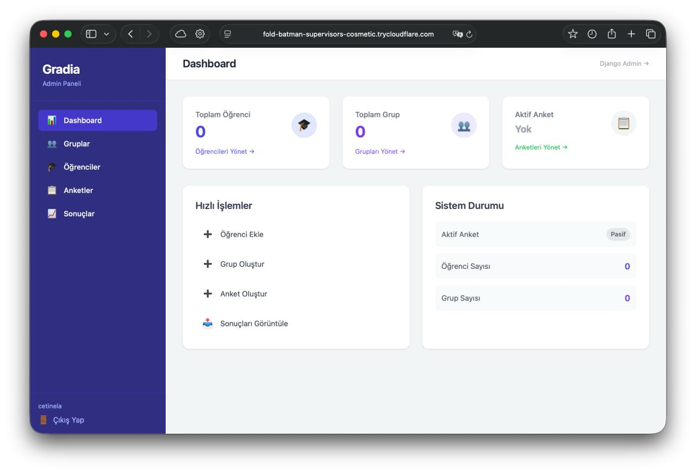

# Gradia — Peer Evaluation System

<p align="center">
  
</p>

<p align="center">
  
  
  
  
  
  
</p>

**Gradia** is a web-based peer evaluation platform built with Django. It allows students to anonymously rate their group members through structured surveys, while administrators manage groups, students, and survey lifecycles — all from a clean, custom admin panel.

---

## Features

- **Peer Evaluation** — Students rate their group members on active surveys with a 1–5 score scale
- **Custom Admin Panel** — Manage groups, students, and surveys without touching Django's default admin
- **Bulk Import via Excel** — Upload an `.xlsx` file to create students and groups in one step
- **Results Export** — Download evaluation results as Excel files (summary + detailed views)
- **Single Active Survey** — Only one survey can be active at a time; activating a new one deactivates others automatically
- **Idempotent Submissions** — Students can update their ratings; submissions use `update_or_create` to prevent duplicates
- **Modern UI** — Responsive interface built with TailwindCSS (CDN)
- **Production-Ready** — Docker Compose stack with Gunicorn, Nginx, and PostgreSQL
- **Secure Public Access** — Cloudflare Tunnel for HTTPS exposure without port forwarding or a public IP

---

## Tech Stack

| Layer | Technology |
|-------|-----------|
| Language | Python 3.12 |
| Framework | Django 5.0.4 |
| Database | PostgreSQL 16 (prod) / SQLite (dev) |
| Application Server | Gunicorn (3 workers) |
| Reverse Proxy | Nginx |
| Frontend | TailwindCSS via CDN |
| Excel Processing | openpyxl |
| Containerization | Docker Compose |
| Public Tunnel | Cloudflare Tunnel (cloudflared) |

---

## Quick Start (Production with Docker + Cloudflare Tunnel)

### 1. Clone the Repository

```bash
git clone https://github.com/atagokmir/Gradia.git
cd Gradia
```

### 2. Configure Environment

```bash
cp .env.example .env
```

Open `.env` and set a strong `SECRET_KEY` and your domain in `ALLOWED_HOSTS`:

```env
SECRET_KEY=your-strong-secret-key-here
DEBUG=False
ALLOWED_HOSTS=yourdomain.com,www.yourdomain.com
CSRF_TRUSTED_ORIGINS=https://yourdomain.com
POSTGRES_DB=gradia
POSTGRES_USER=gradia
POSTGRES_PASSWORD=your-db-password
DATABASE_URL=postgres://gradia:your-db-password@db:5432/gradia
```

### 3. Start Docker Services

```bash
docker-compose up -d
```

On first run, the web container automatically runs `migrate` and `collectstatic`.

### 4. Create a Superuser

```bash
docker-compose exec web python manage.py createsuperuser
```

### 5. Set Up Cloudflare Tunnel

Cloudflare Tunnel exposes your application securely over HTTPS without opening firewall ports or needing a static IP.

**Install `cloudflared`:**

```bash
# macOS
brew install cloudflared

# Debian/Ubuntu
curl -L https://pkg.cloudflare.com/cloudflare-main.gpg | sudo tee /usr/share/keyrings/cloudflare-main.gpg >/dev/null
echo 'deb [signed-by=/usr/share/keyrings/cloudflare-main.gpg] https://pkg.cloudflare.com/cloudflared focal main' | sudo tee /etc/apt/sources.list.d/cloudflared.list
sudo apt-get update && sudo apt-get install cloudflared
```

**Authenticate and create a tunnel:**

```bash
cloudflared tunnel login
cloudflared tunnel create gradia
```

**Configure the tunnel** (`~/.cloudflared/config.yml`):

```yaml
tunnel: <YOUR_TUNNEL_ID>
credentials-file: /root/.cloudflared/<YOUR_TUNNEL_ID>.json

ingress:
  - hostname: yourdomain.com
    service: http://localhost:80
  - service: http_status:404
```

**Add DNS record:**

```bash
cloudflared tunnel route dns gradia yourdomain.com
```

**Run the tunnel:**

```bash
cloudflared tunnel run gradia

# Or run as a system service
cloudflared service install
systemctl start cloudflared
```

> Your application is now publicly accessible at `https://yourdomain.com` with Cloudflare's free SSL, DDoS protection, and CDN.

### 6. Access URLs

| URL | Description |
|-----|-------------|
| `https://yourdomain.com/` | Student login → redirects to survey |
| `https://yourdomain.com/admin-panel/dashboard/` | Custom admin panel |
| `https://yourdomain.com/gizli-x9k2m/` | Django admin (obfuscated path) |

---

## Local Development (without Docker)

```bash
# Create and activate virtual environment
python -m venv venv
source venv/bin/activate   # Windows: venv\Scripts\activate

# Install dependencies
pip install -r requirements.txt

# Configure environment for SQLite
cp .env.example .env
# Set DATABASE_URL=sqlite:///db.sqlite3 in .env

# Initialize database
python manage.py migrate
python manage.py createsuperuser
python manage.py runserver
```

Access the app at `http://localhost:8000`.

---

## Excel Import Format

Upload `.xlsx` files from **Admin Panel → Students → Import Excel** with the following columns:

| Column | Description |
|--------|-------------|
| `ad_soyad` | Full name (first and last, space-separated) |
| `kullanici_adi` | Username for login |
| `ogrenci_no` | Student number — also used as the **default password** |
| `grup` | Group name (auto-created if it doesn't exist) |

> Students authenticate with their `ogrenci_no` as their initial password. Admins should advise students to change it after first login.

---

## Usage Workflow

```
Admin                              Students
  │                                   │
  ├─ Create groups                    │
  ├─ Add students (Excel or manual)   │
  ├─ Assign students to groups        │
  ├─ Create & activate a survey       │
  │                                   │
  │                          Log in at /survey/
  │                          Rate group members (1–5)
  │                          Submit evaluation
  │                                   │
  ├─ View results in admin panel      │
  └─ Export results as Excel          │
```

---

## Project Structure

```
gradia/
├── core/                   # Main Django application
│   ├── models.py           # Student, Group, Survey, Rating models
│   ├── views.py            # All student and admin views
│   ├── decorators.py       # @login_required_custom, @admin_required
│   ├── utils.py            # Excel import/export logic
│   └── templates/core/     # HTML templates
├── gradia/
│   └── settings.py         # Django settings (django-environ)
├── nginx/
│   └── nginx.conf          # Reverse proxy configuration
├── docker-compose.yml
├── Dockerfile
└── requirements.txt
```

---

## Docker Services

| Service | Image | Role |
|---------|-------|------|
| `db` | postgres:16-alpine | Primary database with health checks |
| `web` | atacetinel/gradia:latest | Gunicorn application server |
| `nginx` | atacetinel/gradia-nginx:latest | Reverse proxy + static file serving |

Static files are shared between `web` and `nginx` via a named Docker volume.

---

## CI/CD

Pushing to the `main` branch triggers a GitHub Actions workflow (`.github/workflows/deploy.yml`) that builds and pushes the Docker image to Docker Hub as `atacetinel/gradia:latest`.

Required secrets: `DOCKER_USERNAME`, `DOCKER_TOKEN`.

---

## License

This project is licensed under the [MIT License](LICENSE).
